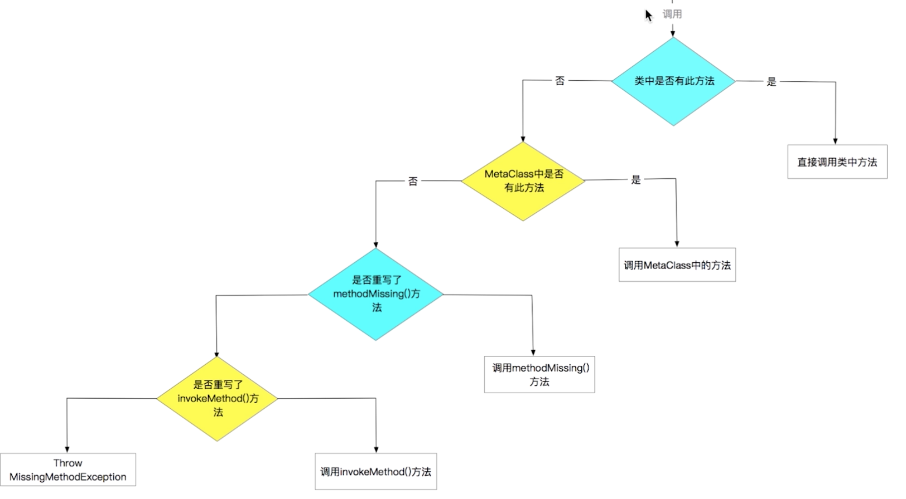
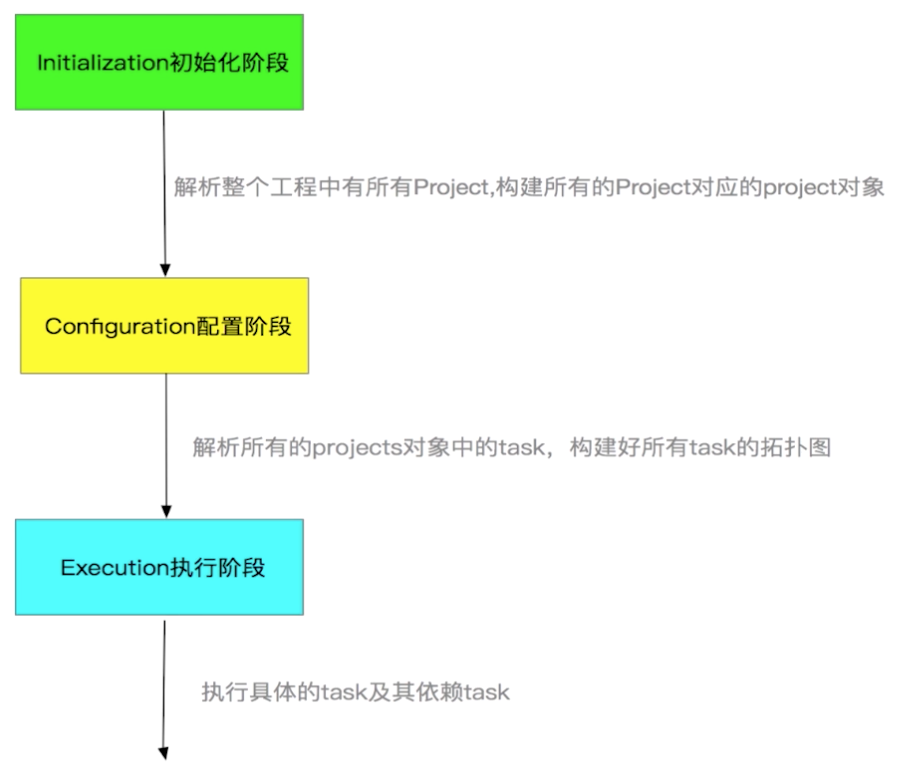

# Groovy快速入门

领域特定语言DSL（Domain  Specific Language）：其核心思想为"求专不求全，解决特定问题"，

Groovy： http://www.groovy-lang.org/
Groovy：是一种基于JVM的敏捷开发语言，结合了Python、Ruby等脚本语言的许多强大特性，可以与Java完美结合，使用Java的所有库；
1. 语法上支持动态类型，闭包等新一代语言特性
2. 无缝继承所有Java的库（可以完全用Java写，但是不推荐）
3. 即支持面向对象编程，也支持面向过程编程

优势：一种更加敏捷的编程语言；入门非常容易，但是功能非常强大；既可以作为编程语言也可以作为脚本语言；熟练掌握Java的人会非常容易掌握Groovy

Groovy开发环境搭建：
> java平台上有各种语言的翻版，例如kotlin对c#,scala对haskell,Clojure对lisp，groovy对ruby

## macOS/Linux
1. 安装配置好JDK
2. 下载Groovy SDK并解压到合适未知
3. 配置bin目录到~/.bash_profile中，如添加如下内容到~/.bash_profile
~~~
export PATH=$PATH:/usr/groovy-2.5.5/bin
~~~
4. groovy -version

## InteliJ IDEA配置
1. 确保已安装Groovy插件
2. 配置Groovy SDK未知

3. 编写Groovy版本HelloWorld，注意查看编译后文件
~~~
//Java版本
class Test {
    public static void main(String[] args){
        System.out.println("Hello world");
    }
}
~~~

~~~
//Groovy版本
print "Hello world"
~~~

# Groovy基础语法
1. 变量
* 变量的类型：基本类型+对象类型，Groovy中没有基本类型，所有的基本类型都会被编译器包装成对象类型，如：int->Integer
* 变量的定义：强类型定义方式+弱类型def定义方式，Groovy中如果变量的值可以推断除其类型，则可通过def声明为弱类型，区别于java中的强类型定义方式，如：int i=1；
* 推荐在自有使用模块使用def方式定义，如果有其他模块或其他类使用推荐强类型定义方式
2. 字符串：String + GString
String的使用和Java中一致，GString定义方式如下：
* def name = 'Hello name' //不支持可扩展字符串
* def doubleName = "Hello doubleName" //可扩展字符串，如：def doubleName = "Hello doubleName and ${name}",结果为： Hello doubleName and Hello name，此时doubleName是org.codehaus.groovy.runtime.GStringImpl的子类
* def thupleName  = '''Hello thupleName'''  //支持多行方式

无可扩展字符串时以上3种方式的String都是java.lang.String的子类，编码过程中String和GString是可以通用的，更多从方便使用角度考虑即可

Groovy字符串方法介绍
* java中String原有的方法
* DefalutGroovyMethods
* StringGroovyMethods：普通类型的参数+闭包类型的参数 
~~~
def str = "Groovy"，str2 = "Hello",str3= "Hello minus"
//字符串填充:center(),paddingLeft(),paddingRight()
println str.center(8,'a')       //aGroovya
//字符串比较：类似于数字比较；compareTo()
println str > str2  //false
//获取字符串索引:类似于数组下标；charAt()
println str[0..1]   //Gr
//减法运算:类似于数字减法；minus()
println str3.minus(str2)    // minus
//其他方法自己摸索
~~~
逻辑控制：单步顺序执行|if／else|switch-case|while|for，基本和Java操作一致，针对Groovy扩展介绍如下：
~~~
//switch-case
def x=1.23,result
switch(x){  //switch(x.class)
    case "name":
        result = "name"
        break
    case Integer:
        result = "Integer"
        break
    case BigDecimal:
        result = "BigDecimal"
        break
    case [1,2,3]:       //列表
        result = "list"
        break
    case 1..10:         //范围
        result = "range"    
    default:
        result="defalut"
}
println result  //BigDecimal
~~~
for循环控制
~~~
//对范围的for循环
def sum =0
for(i in 0..9){
    sum += i
}
println sum //45
//对list的for循环
for(i in [1,2,3,4,5]){
    sum += i
}
//对map的for循环
for(i in ["lili":1,"lucy":2]){
    println i.key + ":" +i.value
}
~~~
3. 闭包
* 闭包就是一个代码块，所以需要通过{}括起来，def clouser = { println "Hello Groovy!"};clouser.call();clouser();  //推荐call()方式调用来区分是闭包
* def clouser = {String name -> println "Hello Groovy ${name}!"};clouser.call("a");clouser("b");
* 隐式参数it：def clouser = {println "Hello Groovy ${it}!"};clouser.call("a");clouser("b");
* 闭包返回值：总是有返回值的，当闭包体没有明确返回值的时候，返回结果就是null
* 如果最后一个参数是闭包，闭包可以写在外面   

闭包的使用
* 与基本类型的结合使用 
~~~
int fab1(int number){
    int result = 1
    1.upto(number,{num -> result *= num  })
    return  result
}

int fab2(int number){
    int result = 1
    number.downto(1) {
        num -> result *= num
    }
    return  result
}

int cal(int number){
    int result = 0
    number.times {
        num -> result += num
    }
    return result
}     
~~~
* 与String结合使用
~~~
def str = "the 2 and 3 is 5"
str.each {String tmp -> print tmp.multiply(2)}  //tthhee  22  aanndd  33  iiss  55
println str.find {String tmp -> tmp.isNumber()} //2
println str.any {String tmp -> tmp.isNumber()}  //true
println str.every {String tmp -> tmp.isNumber()} //false
def list = str.collect {it.toUpperCase()};println list.toListString()   //[T, H, E,  , 2,  , A, N, D,  , 3,  , I, S,  , 5]
~~~
* 与数据结构结合使用
* 与文件等结合使用
* 闭包进阶：闭包关键字（this，owner，delegate）+闭包委托策略
~~~
def scriptClosure = {
    println "scriptClosure this:"+this          //代表闭包定义处的类
    println "scriptClosure owner:"+owner        //代表闭包定义处的类或对象
    println "scriptClosure delegate:"+delegate  //代表任意对象，默认值为owner
}
scriptClosure.call()

//scriptClosure this:Test@3c130745
//scriptClosure owner:Test@3c130745
//scriptClosure delegate:Test@3c130745

class Person{
    def static classClosure = {
        println "classClosure this:"+this
        println "classClosure owner:"+owner
        println "classClosure delegate:"+delegate
    }

    def static say(){
        def methodClosure = {
            println "methodClosure this:"+this
            println "methodClosure owner:"+owner
            println "methodClosure delegate:"+delegate
        }
        methodClosure.call()
    }
}

//静态方法调用
Person.classClosure()
Person.say()
//全部指向Person类,闭包指向离他最近的封闭类
//classClosure this:class Person
//classClosure owner:class Person
//classClosure delegate:class Person
//methodClosure this:class Person
//methodClosure owner:class Person
//methodClosure delegate:class Person

//修改Person类中方法，取消static限定符调用
Person p = new Person()
p.classClosure()
p.say()
//全部指向Person类对象，闭包指向离他最近的封闭类对象
classClosure this:Person@a9cd3b1
classClosure owner:Person@a9cd3b1
classClosure delegate:Person@a9cd3b1
methodClosure this:Person@a9cd3b1
methodClosure owner:Person@a9cd3b1
methodClosure delegate:Person@a9cd3b1

//嵌套闭包
def outerClosure = {
    def innerClosure = {
        println "innerClosure this:"+this
        println "innerClosure owner:"+owner
        println "innerClosure delegate:"+delegate
    }
    innerClosure.call()
}
outerClosure.call()

//innerClosure this:Test@3c130745
//innerClosure owner:Test$_run_closure7@9353778 //指向outerClosure
//innerClosure delegate:Test$_run_closure7@9353778
~~~
总结：this、owner、delegate的值在大多数情况都是一样的，在嵌套闭包中this的值和owner、delegate的值不一致，只有在给delegate赋值后owner和delegate的值才不一致

闭包的委托策略
~~~
class Student{
    String name
    def sayName = { "My name is ${name}"}
    String toString(){
        sayName.call()
    }
}

class Teacher{
    String name
}

def stu = new Student(name: "XingFeng")
println stu.toString()

def tea = new Teacher(name: "Lily")
stu.sayName.delegate = tea
println stu.toString()
stu.sayName.resolveStrategy = Closure.DELEGATE_FIRST    //先从delegate中查找name属性，没有了再从owner中查找
println stu.toString()

//My name is XingFeng
//My name is XingFeng
//My name is Lily
~~~
4. 数据结构
列表的定义：def list = [1,2,3,4] 此为一个ArrayList；
数组的定义：def list = [1,2,3,4] as int[]; int[] arr=[1,2,3]
列表的排序：def list = [1,12,3,444]; Collections.sort(list);list.sort()

map的定义：def colors=["red":1,"blue":2];def colors=[red:1,blue:2]
索引map：println colors.red;println colors["red"];
添加map：colors.yellow=3 //Groovy中map可以添加不同类型的数据：colors.complex =[a:1,b:2]
遍历map： list.each{def tmp,int index -> ...}  list.eachWithIndex{ key,value,index -> ...}
查找map： any  find  findAll every
分组map： groupBy{}
排序map：sort

范围Range：定义 def range = 1..10;println range[0];range.contains(10);println range.from;println range.to
Range继承自java.util.List
~~~
switch(number){
    case 0..<60
        ...
}
~~~
5. 面向对象
类、接口等的定义和使用
* Groovy中默认类、方法等都是public类型
* Groovy中无论是直接调用属性还是通过get／set方法其实质都是通过getter／setter方法调用的属性，getter／setter方法默认自动继承
* 接口实现需实现接口的所有方法；trait中可以有默认方法实现，没有实现的方法需添加abstract关键字，实现时只需实现abstract的方法即可

> 元编程（Metaprogramming）是指某类计算机程序的编写，这类计算机程序编写或者操纵其他程序（或者自身）作为它们的数据，或者在运行时完成部分本应在编译时完成的工作。很多情况下与手工编写全部代码相比工作效率更高。编写元程序的语言称之为元语言，被操作的语言称之为目标语言。一门语言同时也是自身的元语言的能力称之为反射

> 元编程通常有两种方式起作用。一种方式是通过应用程序接口（API）来暴露运行时引擎的内部信息。另一种方法是动态执行包含编程命令的字符串。因此，“程序能编写程序”。虽然两种方法都能用，但大多数方法主要靠其中一种。

~~~
class Baby {
    def invokeMethod(String name,Object args){
        return "the method is ${name},the args is ${args}"
    }

    def methodMissing(String name,Object args){
        return "the method  ${name} is missing}"
    }
}

def baby = new Baby()
println baby.cry() 
~~~
结合上图理解：Java中对象方法的调用没有上图否流程分支，在Groovy中对象方法调用有否分支调用，上例中通过注释invokeMethod、methodMissing方法查看运行效果，通过以下代码可动态添加对象属性和方法：
~~~
Baby.metaClass.sex = "male"
Baby.metaClass.play = { ... }
Baby.metaClass.static.play = { ... }    //静态方法
~~~
通过ExpandoMetaClass.enableGlobally()设置让动态添加方法全局启用

6. Json操作
* 对象转换成JSON字符串：JsonOutput.toJson()
* Json格式化打印：JsonOutput.prettyPrint(jsonObject)
* Json字符串转对象：def jsonSlurper = new JsonSlurper();jsonSlurper.parse()

7. xml操作
* Java对xml的处理：DOM文档驱动处理方式+SAX事件驱动处理方式
* Groovy解析xml数据：def xmlSlurper = new XmlSlurper();def response = xmlSlurper.parse(xml); ／／response对象可以逐级访问节点，节点的属性添加@符号，如：response.books.@id，也可以通过闭包过滤信息
* Groovy深度遍历xml：可以通过逐级遍历解析后的response数据，也可通过response.depFirst().find{ ...}遍历或 response.'**'.find{ ...}遍历（'**'代表深度遍历）
* Groovy深度遍历xml：response.books.children().find{...}或response.books.'*'.find{...}（'*'代表深度遍历）
* Groovy创建xml数据：
~~~
'''
<langs type='current' count='3'>
    <language flavor='static' version='1.5' />
    <language flavor='public' version='2.5' />
</langs>
'''

def sw = new StringWriter()
def xmlBuilder = new MarkupBuilder(sw)
xmlBuilder.langs(type:'current',count:3){
    language(flavor:'static',version:'1.5')
    language(flavor:'public',version:'2.5')
}
println sw

def langs = new Langs()
xmlBuilder.langs(type:langs.type,count:langs.count){
     langs.languages.each {
         language(flavor:it.flavor,version:it.version)
     }
}
println sw
~~~

8. 文件操作
* Java文件处理：节点流（InputStream、OutputStream及其子类）+处理流（Reader、Writer及其子类），所有Java对文件的操作Groovy都支持
* 遍历文件内容：def file = new File("Test.iml");file.eachLine { println it } 或 def text = file.getText() 或 def text = file.readLines() ...

# gradle
Gradle是一款最新的，功能强大的构建工具，使用程序代替传统的xml配置，项目构建更加灵活，有丰富的第三方库

gradle组成：groovy核心语法+build script block+gradle api

## gradle生命周期
执行./gradlew clean 观察执行过程，其生命周期包括：初始化、配置、执行

## gradle生命周期的监听
在项目的build.gradle中添加如下
~~~
//在配置阶段开始之前的回调
this.beforeEvaluate {}

//配置阶段完成以后的回调
this.afterEvaluate {}

//gradle生命周期执行完以后的回调
this.gradle.buildFinished {}
~~~

# Gradle Project
./gradlew projects //查看工程Project数量，学会区分Project与module及根Project与子Project，每个Project必须有一个build.gradle文件

Project API组成：
1. Project相关API：如何管理父Project及如何操作子Project
* this.getAllProjects()，this.getSubProjects(),this.getParent()，在gradl文件中，对应allprojects、project、subprojects进行操作

./gradlew projects可实现显示所有项目，自我实现如下：
~~~
def getProjects(){
    println "------------------------"
    this.getAllprojects().eachWithIndex{ Project project, int index ->
        if(index == 0){
            println "Root project:${project.name}"
        }else{
            println "+--- project:${project.name}"
        }
    }
}

this.getProjects()

//------------------------
//Root project:MyApplication
//+--- project:app
~~~
2. task相关API

3. 属性相关API
* 父Project的属性在子项目中会被继承，可直接使用
* 可以在项目中通过common.gradle文件来定义扩展属性ext，然后在根Project中通过apply from:this.file('common.gradle')引入后，按rootProject.ext.定义属性的方式使用
* 在gradle.properties中定义key-value属性，如：isLoadTest=false，然后在settings.gradle中就可以编码控制是否加载Test项目
~~~
if(hasProperty('isLoadTest')? isLoadTest.toBoolean() : false){
    include ':Test'
}
~~~
自定义属性的两种方式：ext方式+gradle.properties中定义
4. file相关API
* 路径获取API：getRootdir()、getBuildDir()、getProjectDir()
* 文件操作相关API：都是基于根工程操作的，不支持跨工程操作
~~~
//文件／文件夹拷贝
copy {
   from file('test.txt')
   into getRootProject().getBuildDir()
}
//文件树遍历
fileTree('build/'){
    FileTree fileTree -> fileTree.visit{ FileTreeElement element -> ... }
}
~~~
5. gradle生命周期API

6. 其他API
* 依赖相关API
~~~
buildscript {
    repositories {
        google()
        jcenter()
    }
    dependencies {
        classpath 'com.android.tools.build:gradle:3.2.1' 
    }
}
//等价于以下操作：
buildscript { ScriptHandler scriptHandler ->
    scriptHandler.repositories {  RepositoryHandler repositoryHandler ->
        repositoryHandler.google()
        repositoryHandler.jcenter()
    }
    scriptHandler.dependencies {
        classpath 'com.android.tools.build:gradle:3.2.1'
    }
}
~~~
依赖传递：A模块依赖B模块，B模块依赖C模块，如果A模块也需要C模块功能，不需依赖使用，防止B修改后去掉C依赖而导致错误，可在A中引入C模块，通过exclude排除依赖，transitive禁止依赖传递

占位编译provided：A.类库只在编译阶段起作用 B.父项目已引入类库，子项目直接使用父项目类库，但为了子项目编译通过使用占位编译

* 外部命令执行
~~~
task abc() {
    doLast{
        def command = 'ls'
        exec{
            try{
                executable 'bash'
                args '-c',command
                println 'command is execute success.'
            }catch(GradleException ex){
                println "Excepiotn...."
            }
        }
    }
}
~~~
执行：./gradlew abc

# Task
1. Task定义及配置
直接通过task函数去创建
~~~
task("abcd") {
    doLast{
        def command = 'ls -al'
        exec{
            try{
                executable 'bash'
                args '-c',command
                println 'command is execute success.'
            }catch(GradleException ex){
                println "Excepiotn...."
            }
        }
    }
}
~~~
通过TaskContainer创建
~~~
this.tasks.create("aa"){
    println 'Hello task'
}
~~~
Task创建之后可在开发工具的gradle插件重查找到task，如果没有设置group，则默认在other分组中，更多配置可通过task源码查看
2. Task执行详解
doFirst/doLast执行阶段执行，否则在配置阶段执行
~~~
task aa{
    doFirst{
        println 'Hello  2'
    }
}
task.doFirst{
    println 'Hello  1'
}

//Hello  1
//Hello  2
~~~

编写一个统计build时长的task
app.gradle中编写：
~~~
def startBuilderTime,endBuilderTime
this.afterEvaluate { Project project ->
    def preBuildTask = this.tasks.getByName("preBuild")
    preBuildTask.doFirst {
        startBuilderTime = System.currentTimeMillis()
        println '------开始计时...'
    }
    def buildTask = this.tasks.getByName("build")
    buildTask.doLast {
        endBuilderTime = System.currentTimeMillis()
        println '------计时结束,耗时：'+(endBuilderTime - startBuilderTime)
    }
}
~~~
./gradlew build执行查看结果
3. Task的依赖及执行顺序
* dependsOn强依赖方式
~~~
task t1() { doLast{println 'task t1'} }
task t2() << { println 'task t2' }      //此处"<<"等同于doLast
task t3(dependsOn:[t1,t2]) { doLast{println 'task t3'} }
task t4() { dependsOn this.tasks.findAll { task -> return task.name.equals("t2")};doLast{println 'task t4'} }

//./gradlew t3: (t1和t2执行顺序是随机的)
//task t1
//task t2
//task t3

//./gradlew t4
//task t2
//task t4
~~~
* 通过Task输入输出指定
TaskInputs:参数为任意对象及文件、文件夹；TaskOutputs:只输出文件

~~~
ext{
    println '------配置中...'
    versionCode = 100
    versionName = "V2.0.0"
    versionInfo = "第一个版本"
    destFile = file("release.xml")
    if(destFile != null && !destFile.exists()){
        destFile.createNewFile()
    }
}

class VersionMsg{
    Integer versionCode
    String versionName
    String versionInfo
}

task writerTask{
    //为task指定输入
    inputs.property("versionCode",this.versionCode)
    inputs.property("versionName",this.versionName)
    inputs.property("versionInfo",this.versionInfo)
    //为task指定输出
    outputs.file destFile

    doLast{
        def data = inputs.getProperties()
        File file = outputs.getFiles().getSingleFile()
        def versionMsg = new VersionMsg(data)
        def sw = new StringWriter()
        def xmlBuilder = new groovy.xml.MarkupBuilder(sw)
        if(file.text != null && file.text.size() <=0){
            xmlBuilder.releases{
                release{
                    versionCode(versionMsg.versionCode)
                    versionName(versionMsg.versionName)
                    versionInfo(versionMsg.versionInfo)
                }
            }
            file.withWriter { writer ->
                writer.append(sw.toString())
            }
        }else{
            def lines = file.readLines()
            def lengths = lines.size() - 1
            file.withWriter { writer ->
                lines.eachWithIndex{ String line, int index ->
                    if(index != lengths){
                        writer.append(line +"\r\n")
                    }else if(index == lengths){
                        writer.append("\r\n" + sw.toString()+"\r\n")
                        writer.append(lines.get(lengths))
                    }
                }
            }

        }
    }
}

task readTask{
    inputs.file destFile
    doLast{
        def file = inputs.files.singleFile
        println file.text
    }
}

task taskTest{
    dependsOn readTask,writerTask
    doLast{
        println "输入输出任务结束"
    }
}
~~~
destFile作为writerTask输出结果输入到readTask
* 通过API指定执行顺序：mustRunAfter／shouldRunAfter
~~~
task t1() { doLast{println 'task t1'} }
task t2() { mustRunAfter t1 doLast {println 'task t2'} }
~~~
通过./gradlew t2 t1查看执行结果
4. Task类型
详见官方文档：https://docs.gradle.org/current/dsl/org.gradle.api.tasks.Delete.html#org.gradle.api.tasks.Delete
5. 构建到生命周期
~~~
this.project.afterEvaluate {project ->
    println "开始挂接..."
    def buildTask = project.tasks.getByName("build")
    if(buildTask == null) throw GradleException("build Task not found")
    buildTask.doLast {
        writerTask.execute()
    }
}
~~~

# Gradle其他模块
1. Settings类：对应Settings.gradle
~~~
if(hasProperty('isLoadTest')? isLoadTest.toBoolean() : false){
    include ':Test'
}
~~~
2. SourceSet类:AndroidSourceSet/JavaSourceSet,决定了代码、资源、第三方库要存放的位置
~~~
//修改.so等jnilibs的存放位置
android{
    sourceSets {
        main{
            jniLibs.srcDirs = ['libs']
            res.srcDirs = ['src/main/res','src/main/res-ad']    //对res文件夹内容进行分类，但是只能在Project视图查看到效果
        }
    }
}
~~~
3. Gradle的Plugin
* Gradle没有提供创建自定义Gradle插件工程的模板，需要开发者手动创建Gradle插件工程
* 使用Groovy开发，其Gradle插件工程必须遵循如下的目录结构：
 groovy代码必须位于xxxProject/src/main/groovy/目录下
提供插件属性声明文件，该文件必须位于xxxProject/src/main/resources/META-INF/gradle-plugins/xxx.properties

4. android插件对gradle的扩展
android具体能配置那些属性，可查看源码通过BaseExtension查看

gradle插件： https://avatarqing.gitbooks.io/gradlepluginuserguidechineseverision/content/introduction/README.html

varints变体

