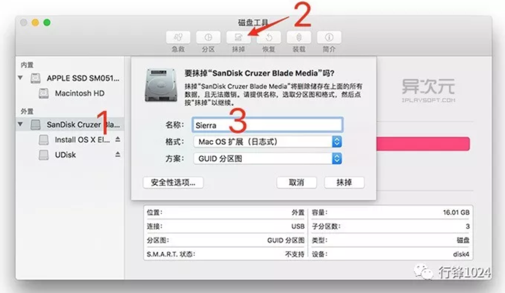

# U盘启动
U盘启动：目的是为了在没有装系统的情况下进行临时启动，它可以启动DOS、备份还原软件或内存中运行的PE系统。现在大部分的电脑都支持U盘启动。U盘启动在系统奔溃和快速安装系统时能起到很大的作用。

# mac系统安装启动盘制作
1. 准备一个 8GB 或更大容量的 U盘，并备份好里面的所有资料
2. 下载好需要安装的系统。在App Store中搜索系统，如：MacOS Sierra，完成下载。
3. 打开 “应用程序 → 实用工具 → 磁盘工具”，将U盘「抹掉」(格式化) 成「Mac OS X 扩展（日志式）」格式、GUID 分区图，并将U盘命名为「Sierra」。(注意：这个盘符名称将会与后面的命令一一对应，如果你改了这盘符的名字，必须保证后面的命令里的名称也要一致)
4. 打开 “应用程序→实用工具→终端”，将下面的一段命令复制并粘贴进去：
~~~
sudo /Applications/Install\ macOS\ Sierra.app/Contents/Resources/createinstallmedia --volume /Volumes/Sierra --applicationpath /Applications/Install\ macOS\ Sierra.app --nointeraction
~~~

回车并执行该命令，这时会提示让你输入管理员密码，便会开始制作过程了：

如上图，这时系统已经在制作中了，请耐心等待直到屏幕最后出现 Done. 字样即表示大功告成了

# mac系统U盘安装
0. （此步骤可选：如果想格式化磁盘则进行此操作）启动时按住[command + r]，进入磁盘管理工具抹掉磁盘即可
1. 先在目标电脑上插上 U 盘，然后重启你的 Mac，然后一直按住[option」(alt)] 按键不放，直到屏幕显示多出一个 USB 启动盘的选项。
2. 选择 U 盘的图标回车，即可通过 U 盘来安装 macOS Sierra 了！这时，你可以直接覆盖安装系统(升级)，也可以在磁盘工具里面格式化抹掉整个硬盘，或者重新分区等实现全新的干净的安装
3. 启动过程中电脑会重启，重启的时候，拔掉U盘

# 安装软件
* 在登陆App Store之后，往常安装过的软件在"已购项目"列表中有，不用每次安装系统后再一一去查找安装过的程序。

非App Store安装的程序，在安装时，又是会提示app出现某些安装包已损坏、显示未激活、打开崩溃等的提示！！这种多是因为新系统屏蔽了任何来源的设置，所以需要大家打开“允许任何来源”方可安装，可按如下方式操作
* 步骤1：Spotlight搜索(快捷键：command+空格或右上角搜索的符号)：搜索 “终端”
* 步骤2：直接复制粘贴 sudo spctl --master-disable   回车
* 步骤3：输入你的 开机密码
* 步骤4：回到系统偏好设置 的“安全与隐私”，勾选 “允许任何来源”完成安装.

# macOS一些其他维护相关知识
官方技术支持网址：https://support.apple.com/zh-cn
1. 关于 Mac 启动时您看到的屏幕：在从 OS X 启动 Mac 时，系统会显示不同的屏幕，以让您了解 Mac 的启动方式，或是启动可能未完成的原因。
https://support.apple.com/zh-cn/HT204156

2. 启动 Mac 时显示闪烁的问号
如果启动时在 Mac 屏幕上看到闪烁的问号，这意味着您的 Mac 无法找到自身的系统软件。
https://support.apple.com/zh-cn/HT204323

3. 如何重新安装 macOS
https://support.apple.com/zh-cn/HT204904

4. 关于 macOS 恢复功能
https://support.apple.com/zh-cn/HT201314

5. 使用 Time Machine 备份或恢复 Mac
https://support.apple.com/zh-cn/HT201250

6. 如何重置 Mac 上的 NVRAM        Command-Option-P-R 
https://support.apple.com/zh-cn/HT204063

7. 重置 Mac 上的系统管理控制器 (SMC)       Shift-Control-Option
https://support.apple.com/zh-cn/HT201295

8. 如何识别 MacBook Pro 机型
https://support.apple.com/zh-cn/HT201300