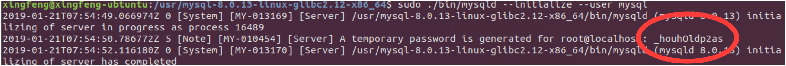

 
# 简介
下载地址：https://dev.mysql.com/downloads/mysql/
官方数据客户端工具： https://dev.mysql.com/downloads/workbench/
推荐客户端工具：Navicat Premium- https://www.navicat.com/en/download/navicat-premium

# 安装登陆
## mac系统
1. 安装dmg安装包，如：mysql-5.7.8-rc-osx10.9-x86_64.dmg，安装过程中会弹出临时的密码，务必截图保存方便后面更改密码，安装过程有时会卡顿，时间会比较长，需耐心等待一会。
2. 在【系统偏好设置】中启动MySQL服务，如果启动不起来，可选择开机启动，然后重启macOS
3. 在MySQLWorkBench中，创建连接信息,hostname-127.0.0.1或localhost，端口3307
4. 点击"Store in Keychain..."输入安装时提示的临时密码后确定
5. 如果临时密码输入正确，则会弹出修改密码界面，修改密码后重新登陆即可

## Linux系统
Linux下安装有多种方式：
1. 直接用软件仓库自动安装（如：ubuntu下，sudo apt-get install mysql-server）
2. 通过下载deb或rmp安装包，直接双击安装
3. 下载tar安装包，解压到硬盘，然后自己配置mysql
4. 通过源码编译安装

以下以tar包安装记录:参考文章（http://www.pianshen.com/article/975954037/）
1. sudo cp mysql-8.0.13-linux-glibc2.12-x86_64.tar.xz /usr
2. cd /usr
3. sudo tar xvJf mysql-8.0.13-linux-glibc2.12-x86_64.tar.xz
4. 为MySQL创建专用用户，用户名为mysql，用户组为mysql；
sudo groupadd mysql //创建组
sudo useradd -r -g mysql mysql //创建用户并划入mysql组下 
5. 为解压出来的所有文件更改用户和组
sudo chown -R mysql mysql-8.0.13-linux-glibc2.12-x86_64 //更改拥有者
sudo chgrp -R mysql mysql-8.0.13-linux-glibc2.12-x86_64 //更改组
6. sudo apt-get install libaio1 libaio-dev
7. 初始化数据库: sudo ./bin/mysqld --initialize --user mysql
执行过程中会生成一个临时密码，一定要保存好，后面修改密码需要用到，如图：

8. 开启服务: bin/mysqld_safe --user=mysql &
9. 使用用户root登录: bin/mysql -uroot -p
10. 更改root用户密码:
~~~
ALTER USER 'root'@'localhost' IDENTIFIED BY 'root' PASSWORD EXPIRE NEVER;   //修改root的密码与加密方式
use mysql; #切换到mysql库 
update user set host='%' where user='root'; //更改可以登录的IP为任意IP
ALTER user 'root'@'%' IDENTIFIED WITH mysql_native_password BY 'root';  //再次更改root用户密码，使其可以在任意IP访问
flush privileges; #刷新权限
~~~
11. 通过客户端测试登陆即可

# Navicat安装
## Linux
1. 进入安装包所在目录下，如：navicat_premium12_cs_x64_for_linux.zip
2. sudo cp navicat_premium12_cs_x64_for_linux.zip /usr/
4. cd /usr/
5. sudo unzip navicat_premium12_cs_x64_for_linux.zip 
6. cd navicat120_premium_cs_x64
7. 命令行启动：sudo ./start_navicat，正常的话应该会出现一个Win Mono下载界面，可不下载，跳过即可 

## Windows & macOS
直接下载安装就行，破解请自行查找